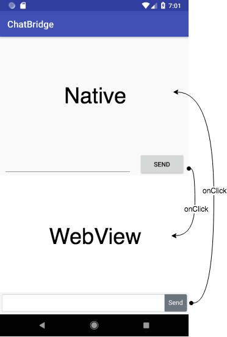

# ChatBridge

## Steps

1. Clone the repository: `git clone https://github.com/adrigzr/chat-bridge`.
2. Open project on [Android Studio](https://developer.android.com/studio/).
3. Open `MainActivity.java` and make the native button send text to the Webview.
4. Open `app.js`, read the text sent and write in on the list element.
5. Make the HTML button send text to the native content.
6. Read the text sent and write it on the native list.
7. Profit!

## What we want to build?

